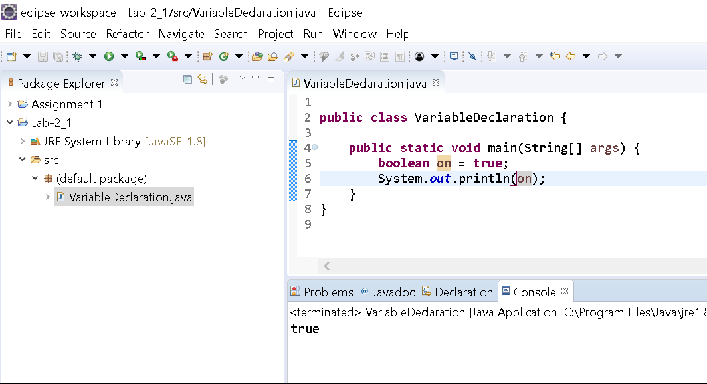
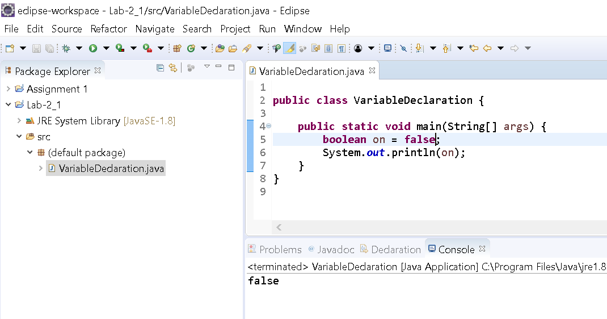
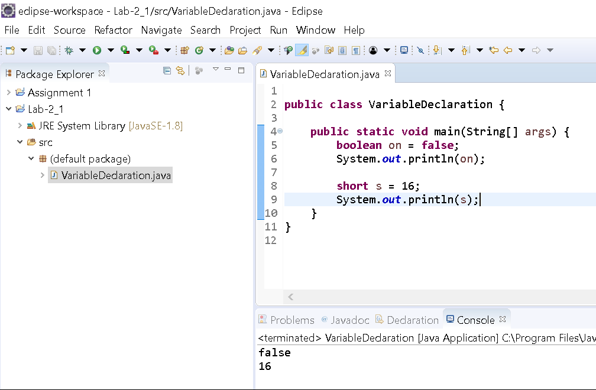
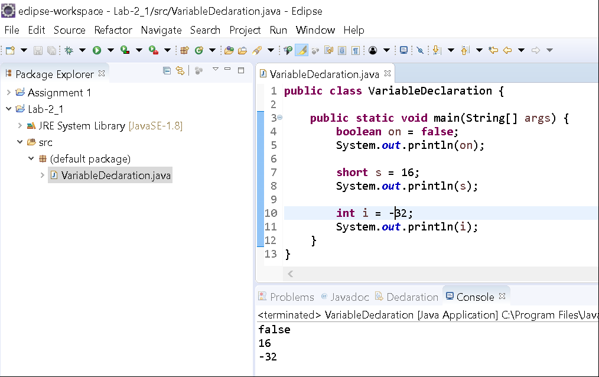
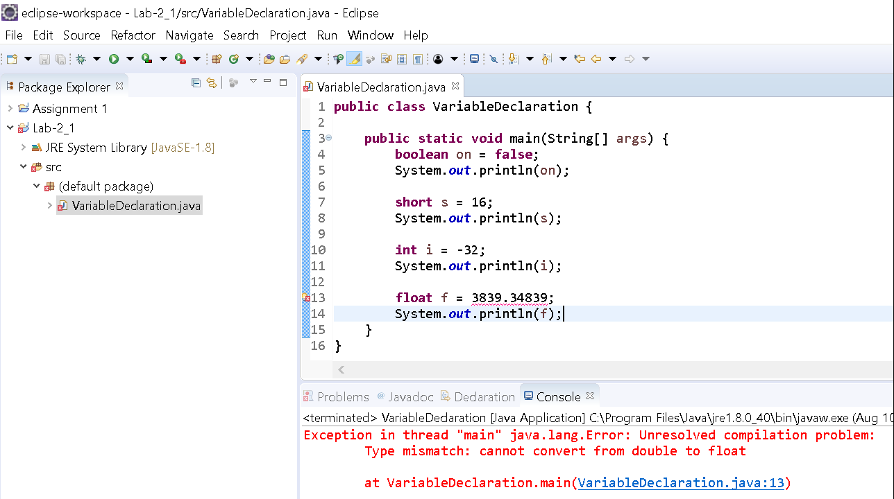
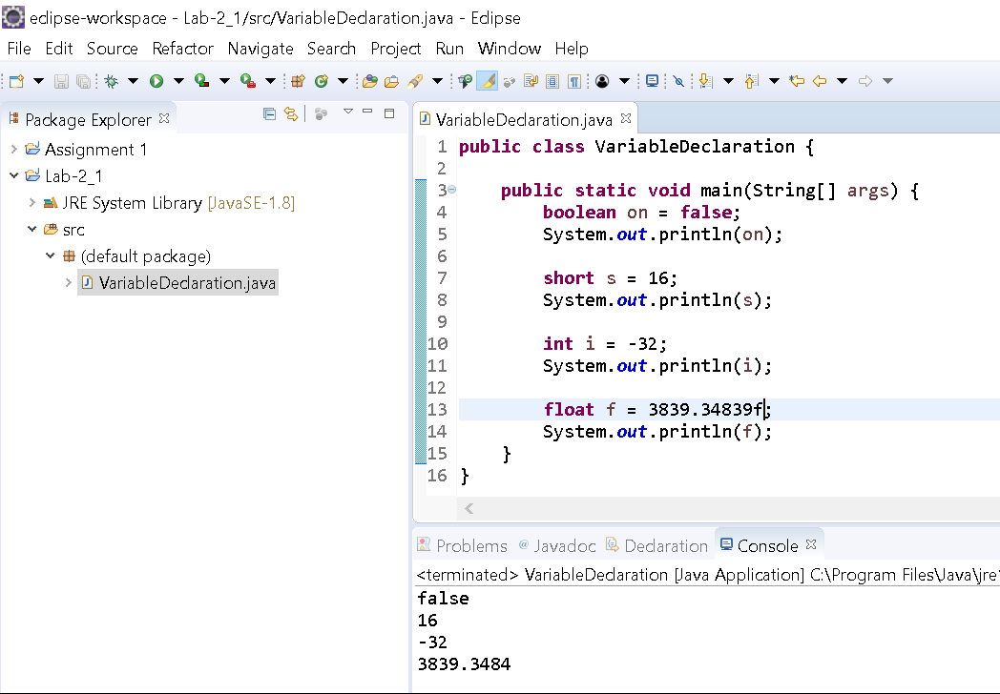
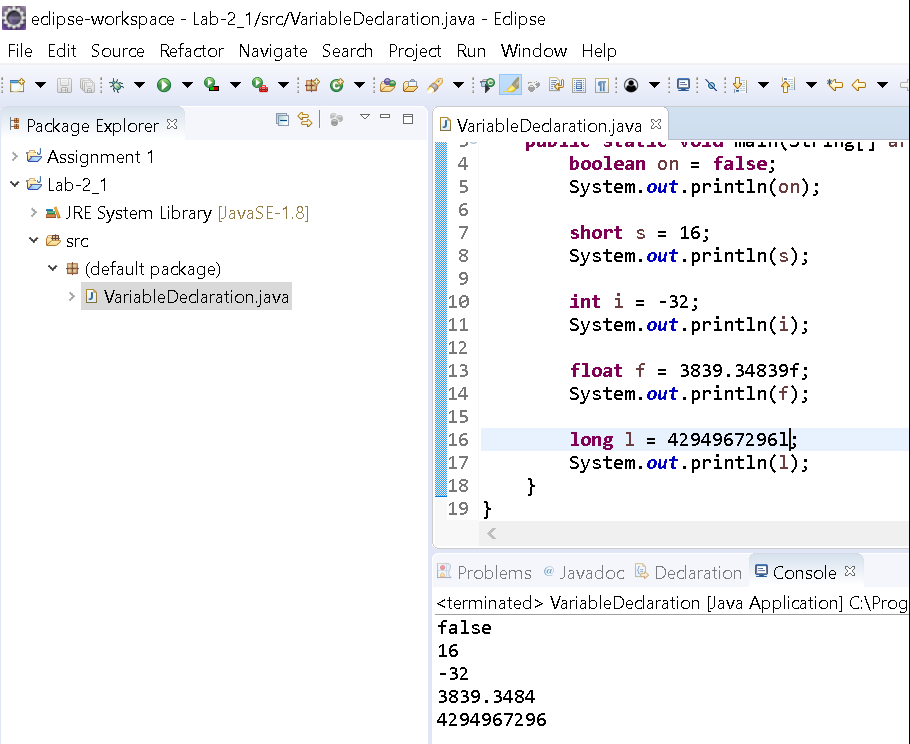
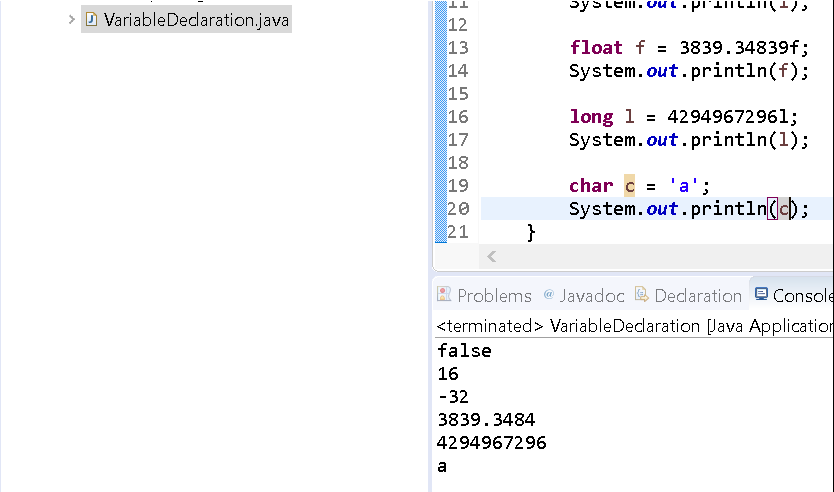

# Displaying Simple Data Types

Objectives
==========

In this lab you will learn how to use primitives in your code. 

Instructions
============

Project Setup
-------------

1\. Open your IDE (Eclipse), and select File > New > Java Project. 

2\. Provide the name, **Lab-Datatypes** and click OK. 

3\. Right-click on the newly created project and select New > Class.

4\. Provide the class the name, **VariableDeclaration** and click OK.

5\. Now edit the file so that it looks like the following:

    public class VariableDeclaration {
    
        public static void main(String[] args){
            boolean on = true;
            System.out.println(on);
        }
    }

6\. Run the program

Note the output. It displays the value of the variable with the name on which is a boolean type variable.

7\. Now edit the file to change the value of the boolean variable _on_ to be false:

    public class VariableDeclaration {
    
        public static void main(String[] args){
            boolean on = false;
            System.out.println(on);
        }
    }

8\. Run the program.

You should now see 'false' printed on the console.

)

Creating Numbers
----------------

Now we'll edit the file to create additional variables that are represent the number types (byte, short, int, double, long, float).

### **short**

Skip a line and edit your code to resemble the following:

    public class VariableDeclaration {
    
        public static void main(String[] args){
            boolean on = false;
            System.out.println(on);
    
            short s = 16;
            System.out.println(s);
        }
    }

Here we've assigned the value of 16 to our variable _s_ which is a **short** datatype.

Run the program.

You'll see the output from your **boolean** variable AND your **short** variable!

)

### **int**

Skip another line and edit your code to resemble the following:

    public class VariableDeclaration {
    
        public static void main(String[] args){
            boolean on = false;
            System.out.println(on);
    
            short s = 16;
            System.out.println(s);
    
            int i = -32;
            System.out.println(i);
     
        }
    }

Here we've assigned the value of -32 to our variable _i_ which is an **int** datatype.

_Run the program._

You'll see the output from your **boolean** variable, your **short** variable and your **int** variable. Notice the negative was captured effectively.

)

### **float**

Skip another line and edit your code to resemble the following:

    public class VariableDeclaration {
    
        public static void main(String[] args){
            boolean on = false;
            System.out.println(on);
    
            short s = 16;
            System.out.println(s);
    
            int i = -32;
            System.out.println(i);
     
            float f = 3839.34839;
            System.out.println(f);
        }
    }

Here we've assigned the value of 3839.34839 to our variable f which is a **float** datatype.

Notice there is a red squiggly line underneath our number and there is a lightbulb with a red 'x' next to the line number.

)

This indicates there is an error with our code at that line.

If we try running our code, we'll get this error:

)

The main portion of this error message indicates an **_Unresolved compilation_** problem, which means that our code will not compile.

Upon further reading we see that it indicates: **Type mismatch: cannot convert from double to float**. It also indicates which file and the line number (13) that the error occurs on.

But, wait? Can't a **float** hold that value and where did **double** come from? We specified **float**…

Well, the compiler, by default expects numbers with decimal places to be **double** type values, so we'll have to edit our code to specify that we want a **float**. To do so, we'll place an 'f' after the value as such:

    public class VariableDeclaration {
    
        public static void main(String[] args){
            boolean on = false;
            System.out.println(on);
    
            short s = 16;
            System.out.println(s);
    
            int i = -32;
            System.out.println(i);
     
            float f = 3839.34839f;
            System.out.println(f);
        }
    }

When you save the file, the red squiggly line and lightbulb should disappear and you'll be able to run the file and view the output as expected:

)

### **long**

Skip another line and edit your code to resemble the following:

    public class VariableDeclaration {
    
        public static void main(String[] args){
            boolean on = false;
            System.out.println(on);
    
            short s = 16;
            System.out.println(s);
    
            int i = -32;
            System.out.println(i);
     
            float f = 3839.34839;
            System.out.println(f);
    
            long l = 4294967296;
    	    System.out.println(l);
        }
    }

Here we've assigned the value of 4294967296 to our variable l which is a long datatype.

Notice there is that red squiggly line again underneath our number and there is a red 'x' this time without a lightbulb next to the line number.

Instead of running the program, _move your mouse cursor_ to hover over the red squiggly line. You'll see a message that will display providing details on the error:

)

It says that The literal 4294967296 of type **int** is out of range. This message is true, if we were trying to declare an **int**. That value (4294967296) corresponds to 2^32 and we know that is 1 more than the max range of an **int**, however, we're trying to make a **long**. The main clue given in this message is the compiler thinks that the datatype is an **int** and not a **long** as we're assigning that value to.

To fix this issue, we simply need to tell the compiler that the value is a **long** datatype. To do so, we'll place a 'l' or 'L' after the value:

    public class VariableDeclaration {
    
        public static void main(String[] args){
            boolean on = false;
            System.out.println(on);
    
            short s = 16;
            System.out.println(s);
    
            int i = -32;
            System.out.println(i);
     
            float f = 3839.34839;
            System.out.println(f);
    
            long l = 4294967296L;
    	    System.out.println(l);
        }
    }

_Run the program_

You'll see the output as expected.

)

Character datatype
------------------

In this next portion, we'll discuss how to define char variables and print out letters to the console. 

### **char**

Skip a line and edit your code to resemble the following:

    public class VariableDeclaration {
    
        public static void main(String[] args){
            boolean on = false;
            System.out.println(on);
    
            short s = 16;
            System.out.println(s);
    
            int i = -32;
            System.out.println(i);
     
            float f = 3839.34839;
            System.out.println(f);
    
            long l = 4294967296L;
    	    System.out.println(l);
    	
    	    char c = 'a';
    	    System.out.println(c);
        }
    }

Here we've assigned the value of 'a' to our variable c which is a **char** datatype.

Notice we surrounded the letter with single quotation marks (').

This is important as the compiler will complain if you leave that off.

_Run the program._

You'll see the output as expected:

By definition a char is a single Unicode character. If you try to place multiple letters in between the quotation marks you'll get an error.

There is another construct called a **String** which we'll learn in another lesson to create a sequence of characters all at once.

Review
======

In this lesson you learned how to define variables of different datatypes. You created values that are considered boolean (true or false), number types (byte, short, int, long, float, double) and even a character type (char). Although, you didn't create a byte specifically, it would follow the same pattern as int or short. 

As a note, we've included a list of Java reserved keywords. As you learn more about variables and constructs that you create, keep in mind that you cannot use the same exact name for variables as any within the list. You must choose your own unique names. 

This completes the Lab. Congratulations! You may now mark this activity complete.